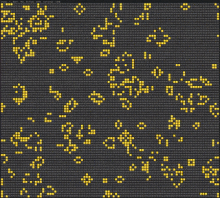

# Conway's Game of Life



> Usage

Construct a new `Cell` object.

```python
import conway

cell = conway.Cell(5, 5, p=0.5)
cell.grid_table()
...
```

Each cell contains two grid_table; `visible` and `hidden` for current and next states.

```bash
{'visible': [[0, 1, 0, 0, 1],
             [0, 0, 0, 1, 0],
             [0, 0, 1, 0, 0],
             [1, 0, 0, 1, 1],
             [0, 1, 0, 0, 1]],
 'hidden': [[0, 0, 0, 0, 0],
            [0, 0, 0, 0, 0],
            [0, 0, 0, 0, 0],
            [0, 0, 0, 0, 0],
            [0, 0, 0, 0, 0]]}
```

Initialize the game of life for a single cell by iterating `num_steps` and calling the `cell.forward()` method.

```python
C = conway.Cell((20, 25), p=0.7)

steps = 50
for t in range(steps):
    stat = C.forward()
    conway.render_jupyter(C, t, stat, ccolor='cy', gcolor='cb')
    conway.fps(16)
...
```

Here's an example of a grid after 49 steps.

```markdown
   steps: 49, born: 0, killed: 440, survived: 60
    ⬜⬜⬜⬜⬜⬜⬜⬜⬜⬜⬜⬜⬜⬜⬜⬜⬜⬜⬜⬜⬜🟢⬜🟢⬜
    ⬜⬜⬜⬜⬜⬜⬜⬜⬜⬜⬜⬜⬜⬜⬜⬜⬜⬜⬜⬜🟢⬜⬜🟢⬜
    ⬜⬜⬜⬜⬜⬜⬜⬜⬜⬜⬜⬜⬜⬜⬜⬜⬜⬜⬜⬜⬜🟢🟢⬜⬜
    ⬜⬜⬜⬜⬜⬜⬜⬜⬜⬜⬜⬜⬜⬜⬜⬜⬜⬜⬜⬜⬜⬜⬜⬜⬜
    ⬜⬜⬜⬜⬜⬜⬜⬜⬜⬜⬜⬜⬜⬜⬜⬜⬜⬜⬜⬜⬜⬜⬜⬜⬜
    ⬜⬜⬜⬜⬜⬜⬜⬜⬜⬜⬜⬜⬜⬜⬜⬜⬜⬜⬜⬜⬜⬜⬜⬜⬜
    ⬜⬜⬜⬜⬜⬜⬜⬜⬜⬜⬜⬜⬜⬜⬜⬜⬜⬜⬜⬜⬜⬜⬜⬜⬜
    ⬜⬜⬜⬜⬜⬜⬜⬜⬜⬜⬜⬜⬜⬜⬜🟢🟢⬜⬜⬜⬜⬜⬜⬜⬜
    ⬜⬜⬜⬜⬜⬜⬜⬜⬜⬜⬜⬜⬜⬜⬜🟢🟢⬜⬜⬜⬜⬜⬜⬜⬜
    ⬜⬜⬜⬜⬜⬜⬜⬜⬜⬜⬜⬜⬜⬜⬜⬜⬜⬜⬜⬜⬜⬜⬜⬜⬜
    ⬜⬜⬜⬜⬜⬜⬜⬜⬜⬜⬜⬜⬜⬜⬜⬜⬜⬜⬜⬜⬜⬜⬜⬜⬜
    ⬜⬜⬜⬜⬜⬜⬜⬜⬜🟢🟢⬜⬜⬜⬜⬜⬜⬜⬜⬜⬜⬜⬜⬜⬜
    ⬜⬜⬜⬜⬜⬜⬜⬜🟢⬜⬜🟢⬜⬜⬜⬜⬜⬜⬜⬜⬜⬜⬜⬜⬜
    ⬜⬜⬜⬜⬜⬜⬜⬜🟢⬜⬜🟢⬜⬜⬜⬜⬜⬜⬜⬜⬜⬜⬜⬜⬜
    ⬜⬜⬜⬜⬜⬜⬜⬜⬜🟢🟢⬜⬜⬜⬜⬜⬜⬜⬜⬜⬜⬜⬜⬜⬜
    ⬜⬜⬜⬜⬜⬜⬜⬜⬜⬜⬜⬜⬜⬜⬜⬜⬜⬜⬜⬜⬜⬜⬜⬜⬜
    ⬜⬜🟢🟢⬜⬜⬜⬜⬜⬜⬜⬜⬜⬜⬜⬜⬜⬜⬜⬜⬜⬜⬜⬜⬜
    ⬜⬜🟢🟢⬜⬜⬜⬜⬜⬜⬜⬜⬜⬜⬜⬜⬜⬜⬜⬜⬜⬜⬜⬜⬜
    ⬜⬜⬜⬜⬜⬜⬜⬜⬜⬜⬜⬜⬜⬜⬜⬜⬜⬜⬜⬜⬜⬜⬜⬜⬜
    ⬜⬜⬜⬜⬜⬜⬜⬜⬜⬜⬜⬜⬜⬜⬜⬜⬜⬜⬜⬜⬜⬜🟢⬜⬜
```

You can also construct a batch of cells with the `CellBatch` container class.

```python
batch = conway.CellBatch([
    conway.Cell(shape=(14, 17), p=0.3),
    conway.Cell(shape=(15, 20), p=0.1),
])
print(batch)
...
#  CellBatch(batch_size=2)
```

```python
list(batch)
...
#  [Cell(shape=(14, 17)), Cell(shape=(15, 20))]
```

```python
for C in batch:
    print(C.id, C.shape, C.hidden[0])
...
#  cell_0 (14, 17) [0, 0, 0, 0, 0, ...]
#  cell_1 (15, 20) [0, 0, 0, 0, 0, 0, 0, 0, 0, 0, 0, ...]
```

```python
max_steps = 60
for C in batch:
    t = 0
    while t < max_steps:
        stats = C.forward()
        conway.render_jupyter(C, t, stats)
        conway.fps(10)
        t += 1
...
```

```markdown
   steps: 59, born: 22, killed: 194, survived: 84
    ⬜⬜⬜⬜⬜🔴🔴🔴⬜⬜⬜🔴🔴🔴⬜⬜⬜⬜⬜⬜
    ⬜⬜⬜⬜⬜🔴🔴🔴⬜⬜⬜🔴🔴🔴⬜⬜⬜⬜⬜⬜
    ⬜⬜⬜⬜⬜⬜🔴🔴⬜⬜⬜🔴🔴⬜⬜⬜⬜⬜⬜⬜
    🔴🔴⬜⬜⬜⬜⬜🔴🔴🔴🔴🔴⬜⬜⬜⬜⬜⬜⬜⬜
    🔴🔴⬜⬜⬜⬜⬜⬜🔴🔴🔴⬜⬜⬜⬜⬜⬜⬜⬜⬜
    ⬜⬜⬜⬜⬜⬜⬜⬜🔴🔴🔴⬜⬜⬜⬜⬜⬜⬜⬜⬜
    ⬜⬜⬜⬜⬜⬜⬜⬜⬜⬜⬜⬜⬜⬜⬜⬜⬜⬜⬜⬜
    ⬜⬜⬜⬜🔴🔴⬜⬜⬜⬜⬜⬜⬜🔴🔴⬜⬜⬜⬜⬜
    ⬜⬜⬜🔴⬜⬜🔴⬜⬜⬜⬜⬜🔴⬜⬜🔴⬜⬜⬜⬜
    ⬜⬜⬜⬜🔴🔴⬜⬜⬜⬜⬜⬜⬜🔴🔴⬜⬜⬜⬜⬜
    ⬜⬜⬜⬜⬜⬜⬜⬜⬜⬜⬜⬜⬜⬜⬜⬜⬜⬜⬜⬜
    ⬜⬜⬜⬜⬜⬜⬜⬜🔴🔴🔴⬜⬜⬜⬜⬜⬜⬜⬜⬜
    ⬜⬜⬜⬜⬜⬜⬜⬜🔴🔴🔴⬜⬜⬜⬜⬜⬜⬜⬜⬜
    🔴⬜⬜⬜⬜⬜⬜🔴🔴🔴🔴🔴⬜⬜⬜⬜⬜⬜⬜🔴
    🔴⬜⬜⬜⬜⬜🔴🔴⬜⬜⬜🔴🔴⬜⬜⬜⬜⬜⬜🔴
```

## Demo script

- `k`: N steps to accumulate (.0 losses) before evaluating a state as *"halted"*.
- `p`: Initial population density (0.0 to 1.0). e.g., *{0.2 low, 0.5 medium, 0.8 high}* etc.

```python
import random
from dataclasses import dataclass

import conway
from conway import all_blocks, fps

# Remove black color in dark theme environments.
cell_colors = list(all_blocks.keys())
cell_colors.pop(cell_colors.index('sb'))


def color_choices():
    return random.choice(cell_colors)


@dataclass
class Hist:
    # Customize what information to render (optional).
    gen: int = 0
    born: int = 0
    killed: int = 0
    survived: int = 0
    loss: float = 0.0

env = conway.Env(
    conway.Cell([32, 64], p=1 - 0.6),
    k=3,
    render='console',
    return_dict=True,
)

ngens = 5
t = 0
gen = 0
rnd_color = color_choices()  # Random cell color per generation.

# Independent sampling probability used for drawing the ~Bernoulli(p) dist.
p_dist = [round(random.uniform(0.2, 0.8), 1) for p_sample in range(ngens)]

while gen < ngens:
    stat, loss, done = env.step(t)
    hist = Hist(gen+1, loss=loss, **stat)
    env.render(t, hist, ccolor=rnd_color)
    fps(18)
    if done:
        next_p = p_dist.pop()
        env = env.reset(p=next_p)
        rnd_color = color_choices()
        gen += 1
    t += 1
...
```

`steps: 2025, gen: 5 | born: 10 | killed: 1907 | survived: 131 | loss: 0.0`
